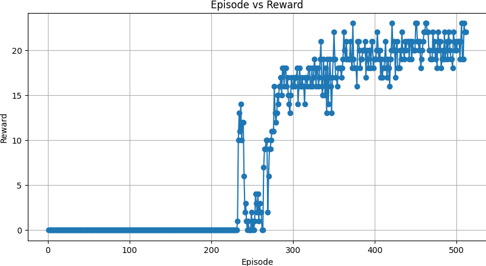

# Atari Freeway RL

Deep reinforcement learning experiments on the Atari Freeway environment using PyTorch and Gymnasium.

<p align="center">
  
</p>

---

## Motivation

This project explores value-based and policy-based reinforcement learning methods in sparse-reward Atari environments.

The primary goal was to study how deep neural networks learn control policies directly from pixel observations while comparing different reinforcement learning strategies under a shared environment setup.

The repository focuses on:
- perception-driven policy learning
- environment interaction
- experience replay
- temporal difference learning
- policy optimization in sparse reward settings

---

## Environment

- **Environment:** ALE / Freeway-v5
- **Framework:** Gymnasium
- **Backend:** PyTorch
- **Observation Type:** RGB image observations
- **Action Space:** Discrete control actions

The Freeway environment presents a sparse reward challenge where the agent must learn to cross lanes of moving traffic without collisions.

---

## Implemented Agents

| Agent | Description |
|---|---|
| DQN | Deep Q-Network with experience replay and target network updates |
| A2C | Advantage Actor-Critic implementation |
| REINFORCE | Monte Carlo policy gradient baseline |

---

## Repository Structure

```text
agents/
assets/
configs/
scripts/
main.py
requirements.txt
README.md
```

---

## Installation

Clone the repository:

```bash
git clone https://github.com/<your-username>/atari-freeway-rl.git
cd atari-freeway-rl
```

Create a virtual environment:

### Windows

```bash
python -m venv .venv
.venv\Scripts\activate
```

### Linux / MacOS

```bash
python3 -m venv .venv
source .venv/bin/activate
```

Install dependencies:

```bash
pip install -r requirements.txt
```

Install Atari environment dependencies:

```bash
pip install "gymnasium[atari]"
pip install "gymnasium[other]"
```

---

## Usage

### Train DQN Agent

```bash
python main.py --agent dqn
```

### Train A2C Agent

```bash
python main.py --agent a2c
```

### Train REINFORCE Agent

```bash
python main.py --agent reinforce
```

---

## Evaluation

Run evaluation using:

```bash
python -m scripts.evaluate
```

---

## Results

### DQN Training Curve

<p align="center">
  
</p>

The DQN agent demonstrated the strongest and most stable learning behavior among the tested approaches.

Observed learning characteristics:
- delayed reward discovery
- sparse reward exploration challenges
- stable convergence after exploration phase
- improved policy consistency over training

---

## Best Performing Approach

The DQN implementation achieved the best overall performance due to:
- experience replay stabilization
- target network updates
- improved sample efficiency
- more stable temporal difference learning

---

## Outputs

Training outputs include:
- reward curves
- gameplay recordings
- TensorBoard logs

Generated assets are stored locally during training.

---

## Dependencies

Core libraries:
- PyTorch
- Gymnasium
- NumPy
- OpenCV
- Matplotlib
- TensorBoard
- ALE-Py

Install all dependencies using:

```bash
pip install -r requirements.txt
```

---

## Future Improvements

- Double DQN
- Prioritized Experience Replay
- PPO implementation
- Observation preprocessing wrappers
- Hyperparameter sweeps
- Evaluation benchmarking pipeline
